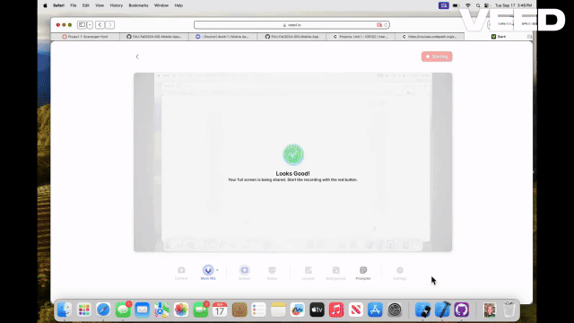

# Photo Scavenger Hunt - A Geolocation-Based Task Completion App

**Photo Scavenger Hunt** is an interactive mobile application that encourages users to complete various tasks by attaching photos as evidence of completion. Upon adding a photo, the app records the location where the photo was taken and displays it on a map. The app allows users to create and manage tasks, offering an engaging way to track progress and share experiences.

Whether you're on a scavenger hunt, completing a geocaching challenge, or just having fun with friends, this app lets you document and share your favorite moments, one task at a time.

- Developer: Noah Russell
- Development Time: 3.5 hours
- Technologies Used: Swift, SwiftUI, Xcode

## Features

The following required features have been successfully implemented:

- [✅] Task List: The app displays a hard-coded list of tasks for the user to complete.
- [✅] Task Detail View: When a task is tapped, users are navigated to a detailed view of the task.
- [✅] Photo Upload: Users can upload a photo to complete a task. The app tracks and attaches the location where the photo was taken.
- [✅] Task Completion: After uploading the photo, the task status is updated to "complete," and the user returns to the task list.
- [✅] Task Creation: Users can create new tasks by tapping the "+" button, which navigates them to a task creation view.
- [✅] Photo Viewing: After attaching a photo to a task, users can view the photo in the task detail view.

## Optional Features

The following optional features are planned for future versions:

- [❌] Camera Integration: Allow users to directly launch the camera to snap a picture within the app.

## Future Enhancements

Potential future features include:

- [🔲] Geocaching Functionality: Transform the app into a full-fledged geocaching app with more interactive tasks and geolocation-based challenges.
- [🔲] Task Sharing: Implement functionality to share completed tasks with friends or social media platforms.
- [🔲] Task Sorting: Enable users to sort tasks by various criteria such as "completed" vs. "incomplete" or by date.

## Setup Instructions

To run the Photo Scavenger Hunt app locally, follow these steps:

1. Clone the Repository:
- git clone https://github.com/your-username/Photo-Scavenger-Hunt.git
- cd Photo-Scavenger-Hunt
2. Open in Xcode:
- Open the .xcodeproj or .xcworkspace file in Xcode.
3. Install Dependencies:
- If using CocoaPods or Swift Package Manager, install the required libraries (if any):
- pod install
4. Build and Run:
- Select the desired simulator or physical iOS device.
- Click the “Run” button to build and launch the app.
5. Test:
- Add tasks, upload photos, and view the task statuses being updated in real-time.
- Test task creation by using the "+" button and adding new tasks.

## Video Walkthrough

Here’s a quick demonstration of the app’s core features:

GIF created with VEED.io.

## Development Process

This app was built with SwiftUI to create a simple, responsive UI that allows users to interact with tasks and photos in a seamless way. The app uses MapKit to display the location of each photo, giving users visual context about where their tasks were completed.

## Challenges Faced

- Task Creation and Management: Managing task state and ensuring the app updates the UI correctly when tasks are created or completed.
- Photo Integration: Ensuring that the app accurately records and displays the photo location.

## Key Takeaways
- Learned how to integrate MapKit with SwiftUI for displaying geolocation data.
- Gained experience with task management features and updating UI based on user interactions.
- Enjoyed creating a project that could potentially evolve into a geolocation-based game or tool for exploration.

## Technologies Used

- Programming Language: Swift
- Frameworks: SwiftUI, MapKit
- Development Environment: Xcode 14.0+
- Version Control: Git, GitHub

## License

Photo Scavenger Hunt is licensed under the Apache License 2.0.
You may obtain a copy of the license at:
http://www.apache.org/licenses/LICENSE-2.0
